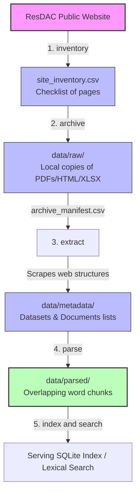

# RKB User Manual

Welcome to the User Manual for the **ResDAC Knowledge Base (RKB)** toolkit. This guide is written specifically for users with zero background in command-line tools or database management. By the end of this manual, you will know how to discover, download, extract, and parse CMS (Centers for Medicare & Medicaid Services) documentation into a local, search-ready data archive.

---

## Table of Contents
1. [What is RKB?](#1-what-is-rkb)
2. [Key Concepts & Terminology](#2-key-concepts--terminology)
3. [Visualizing the System](#3-visualizing-the-system)
4. [Getting Started (Prerequisites & Installation)](#4-getting-started-prerequisites--installation)
5. [Step-by-Step Tutorial (Zero to Chunks)](#5-step-by-step-tutorial-zero-to-chunks)
6. [Detailed Command Reference](#6-detailed-command-reference)
7. [Understanding Your Output Data](#7-understanding-your-output-data)
8. [Roadmap (Future Commands)](#8-roadmap-future-commands)
9. [Troubleshooting Guide](#9-troubleshooting-guide)

---

## 1. What is RKB?

**RKB** is a command-line application that helps researchers and software agents download, process, and search documentation from the **Research Data Assistance Center (ResDAC)**. 

ResDAC provides public information on CMS data files (such as Medicare and Medicaid records). This documentation changes over time and is spread across hundreds of webpages, PDFs, and spreadsheets. **RKB** acts as your local archiver and text parser: it grabs the pages, validates their integrity (ensuring they aren't corrupted), organizes them, and splits them into small, searchable text "chunks."

---

## 2. Key Concepts & Terminology

If you are new to command-line tools, here are a few simple definitions of terms used throughout this guide:

*   **Command Line (Terminal)**: A text-based screen where you type commands to make your computer perform tasks, instead of clicking buttons in a graphical window.
*   **Directory / Folder**: The command-line term for a folder on your computer.
*   **Path**: The "address" of a file or folder on your computer (e.g., `data/raw/file.pdf` tells the computer to look inside `data`, then `raw`, to find `file.pdf`).
*   **Inventory / Crawl**: The process of scanning the ResDAC website to find all pages and downloadable files, creating a "to-do checklist."
*   **Archive**: The collection of actual files (PDFs, HTML web pages, Excel sheets) downloaded onto your local computer.
*   **Metadata**: Information *about* your files, such as when they were downloaded, how large they are, their category, and their unique IDs.
*   **Chunking**: Splitting a long document's text into smaller, overlapping paragraphs (e.g., 500 words at a time). This is crucial for search engines and AI agents to find exact answers without reading a 200-page PDF.
*   **Provenance**: A verifiable paper trail showing exactly where every piece of data came from (e.g., the exact source URL and download timestamp).

---

## 3. Visualizing the System

### The Data & Process Flow
The following diagram shows the step-by-step workflow of RKB, starting from the public website down to your search-ready text chunks:



### The Directory Tree Structure
When you run RKB, it creates and reads files in a structured layout. Here is the visual layout of your project folder after you complete all steps:

```text
rkb-project-root/
│
├── manifests/                      # Checklists and catalogs
│   ├── site_inventory.csv          # Discoveries from the web
│   ├── site_inventory_edges.csv    # How discovered pages link together
│   └── archive_manifest.csv        # Log of successfully downloaded files
│
├── data/                           # Where downloaded & processed data goes
│   ├── raw/                        # Original PDFs, HTML pages, and Excel sheets
│   │   ├── resdac.org/
│   │   └── ...
│   │
│   ├── metadata/                   # Cleaned Excel/Web table listings
│   │   ├── datasets.csv            # Catalog of CMS datasets
│   │   ├── documents.csv           # Catalog of documentation guides
│   │   └── document_edges.csv      # Relationships between documents
│   │
│   └── parsed/                     # Text extracted and chunked
│       ├── html/                   # Plain text files extracted from web pages
│       ├── pdf/                    # Plain text files extracted from PDFs
│       ├── xlsx/                   # Plain text files extracted from spreadsheets
│       ├── chunks.jsonl            # The final searchable JSON stream of paragraphs
│       └── workspace_parsed.json   # Summary of parsing counts
│
└── _workspace/                     # Temporary progress trackers & logs
    ├── 02_inventory_progress.jsonl # Progress tracker for inventory
    └── 03_archive_progress.jsonl   # Progress tracker for downloads
```

---

## 4. Getting Started (Prerequisites & Installation)

### step 4.1: Accessing the Command Line
*   **macOS**: Press `Cmd + Space` on your keyboard, type **Terminal**, and press `Enter`.
*   **Windows**: Install **WSL (Windows Subsystem for Linux)** or use **Git Bash**. Avoid the standard Windows Command Prompt (cmd) or PowerShell unless configured for Unix-like commands.

### step 4.2: Compiling or Running the Binary
To verify that you can run RKB, type the following command in your terminal and press `Enter`:

```bash
cargo run -- --version
```
*(If you are using a pre-packaged binary instead of compiling from source, you would run `./rkb --version` instead).*

If working correctly, it will print:
```text
rkb 0.1.0
```

To see all available commands, run:
```bash
cargo run -- --help
```

---

## 5. Step-by-Step Tutorial (Zero to Chunks)

Follow these four commands in order to build your local documentation database.

### Step 1: Discover Pages and Files (`inventory`)
First, search the ResDAC website to build a checklist of files to download. Run this command:

```bash
cargo run -- inventory --max-pages 5
```
*   **What it does**: Scans up to 5 listing pages of the ResDAC website and builds a list of downloadable items.
*   **What is created**:
    *   `manifests/site_inventory.csv` (The checklist of files).
    *   `_workspace/02_inventory_progress.jsonl` (A progress log).

### Step 2: Download the Files (`archive`)
Now, download all files from your checklist to your local disk:

```bash
cargo run -- archive --max-downloads 10
```
*   **What it does**: Downloads up to 10 files from your checklist into your local folder. It safely pauses between downloads so it does not overload the ResDAC server.
*   **What is created**:
    *   `data/raw/` (Folder containing downloaded web pages, PDFs, and spreadsheets).
    *   `manifests/archive_manifest.csv` (Log of successfully downloaded files with checksum safety records).

### Step 3: Extract Metadata (`extract`)
Organize the raw files you downloaded, sorting datasets and documents:

```bash
cargo run -- extract
```
*   **What it does**: Reads your downloads and pulls out dataset categories, document names, and page linkages.
*   **What is created**:
    *   `data/metadata/datasets.csv`
    *   `data/metadata/documents.csv`

### Step 4: Parse and Split Text (`parse`)
Extract the plain text from your downloads and divide it into overlapping paragraph chunks:

```bash
cargo run -- parse
```
*   **What it does**: Opens HTML, PDF, and XLSX files, extracts their written text, and splits it into searchable segments.
*   **What is created**:
    *   `data/parsed/chunks.jsonl` (Your search-ready text segments).
    *   `_workspace/05_parsing_pack.md` (A summary of parsed documents).

### Step 5: Extract Variables (`variables`)
Extract variable names and definitions from parsed chunks and archived ResDAC variable pages:

```bash
cargo run -- variables
```
*   **What it does**: Finds definition-bearing variable identifiers, deduplicates them, and preserves the URL, local document, page, and chunk evidence.
*   **What is created**:
    *   `data/metadata/variables.csv`
    *   `data/metadata/canonical_variables.csv`
    *   `data/graph/variable_edges.csv`
    *   `data/graph/data_source_variable_edges.csv`
    *   `_workspace/07_variable_pack.md`

---

## 6. Detailed Command Reference

### `inventory`
Scan the website to discover documentation lists.

```bash
cargo run -- inventory [FLAGS]
```

**Key Parameters (Options)**:
*   `--base-url <URL>`: The ResDAC homepage to start scanning (Default: `https://resdac.org/cms-data`).
*   `--max-pages <NUMBER>`: Maximum search result pages to scan. Set this small (e.g., `2` or `5`) to test, or large (e.g., `100`) to scan the full site.
*   `--output <PATH>`: Where to save the discovered list (Default: `manifests/site_inventory.csv`).
*   `--request-delay-seconds <SECONDS>`: How long to wait between scanning webpages, protecting the server (Default: `0.5`).

---

### `archive`
Download and verify raw files from the inventory list.

```bash
cargo run -- archive [FLAGS]
```

**Key Parameters (Options)**:
*   `--inventory <PATH>`: Address of the checklist file from Step 1 (Default: `manifests/site_inventory.csv`).
*   `--raw-root <PATH>`: Address of the folder where downloads are saved (Default: `data/raw`).
*   `--max-downloads <NUMBER>`: Stop downloading after this many files. Helpful to limit bandwidth.
*   `--retry-failed-only`: If running a second time, skip files that succeeded and only download previously failed files.
*   `--max-consecutive-rate-limits <NUMBER>`: Defer remaining variable pages after this many consecutive HTTP 429 responses (Default: `5`).
*   `--rate-limit-cooldown-seconds <SECONDS>`: Additional cooldown after a final HTTP 429 response (Default: `0`).
*   `--request-delay-seconds <SECONDS>`: Delay between download requests (Default: `0.5`).

**Important:** Flags belong after the subcommand. Use `rkb archive --retry-failed-only`, not `rkb --retry-failed-only`.

---

### `extract`
Scrape specific document metadata and dataset schemas.

```bash
cargo run -- extract [FLAGS]
```

**Key Parameters (Options)**:
*   `--archive-manifest <PATH>`: Address of the download log (Default: `manifests/archive_manifest.csv`).
*   `--metadata-dir <PATH>`: Where to save organized tables (Default: `data/metadata`).

---

### `parse`
Extract text and slice it into search-ready chunks.

```bash
cargo run -- parse [FLAGS]
```

**Key Parameters (Options)**:
*   `--chunk-size <WORDS>`: Maximum words in each text segment (Default: `500`).
*   `--chunk-overlap <WORDS>`: Word count overlap between consecutive text segments, ensuring no context is lost at boundaries (Default: `100`).

---

### `variables`
Extract variable definitions and provenance links.

```bash
cargo run -- variables [FLAGS]
```

**Key Parameters (Options)**:
*   `--chunks-jsonl <PATH>`: Parsed chunk stream (Default: `data/parsed/chunks.jsonl`).
*   `--archive-manifest <PATH>`: Archived variable-page ledger (Default: `manifests/archive_manifest.csv`).
*   `--metadata-dir <PATH>`: Variable catalog output directory (Default: `data/metadata`).
*   `--graph-dir <PATH>`: Variable relationship output directory (Default: `data/graph`).

---

### `qa`
Validate metadata, graph references, archived evidence, and checksums.

```bash
cargo run -- qa [OPTIONS]
```

The command writes `_workspace/06_qa_review.md`. A `PASS` verdict exits successfully;
`FIX` and `REDO` identify bounded or structural provenance failures and exit nonzero.
Every input artifact can be overridden with its corresponding `--*-metadata`, `--*-edges`,
`--archive-manifest`, or `--workspace-dir` option.

---

### `index`
Build the local SQLite FTS5 search index from canonical metadata and parsed chunks.

```bash
cargo run -- index
```

Use `--datasets-metadata`, `--documents-metadata`, `--variables-metadata`,
`--chunks-jsonl`, and `--database-path` to override artifact locations.

---

### `search`
Query the built index and return citation-bearing lexical results.

```bash
cargo run -- search --query "BENE_ID" --limit 5
cargo run -- search --query "dual eligibility" --json
```

Run `index` after canonical artifacts change. Search requires the index plus the required
dataset and document metadata files.

---

### `agent-context`
Format indexed search results as citation-preserving context for agent consumers.

```bash
cargo run -- agent-context --query "BENE_ID" --limit 5
cargo run -- agent-context --query "dual eligibility" --json
cargo run -- agent-context --query "BENE_ID" --hybrid
```

The command uses the same artifact path overrides as `search` and succeeds with an
empty context when the index has no matching records.

---

### `evaluate`
Measure retrieval usefulness with seeded variable-name checks or benchmark questions.

```bash
cargo run -- evaluate --sample-size 10 --seed 20260616
cargo run -- evaluate --sample-size 10 --json
cargo run -- evaluate --benchmark data/evaluation/benchmark_questions.json --output-report _workspace/retrieval_evaluation_report.md
```

The command uses the same artifact path overrides as `search`. Benchmark mode compares
lexical, hybrid-fallback, and agent-facing metrics, then writes a Markdown report.

---

### `mcp`
Serve read-only MCP-style tools over line-delimited stdio JSON-RPC.

```bash
cargo run -- mcp
cargo run -- mcp status
cargo run -- mcp start --host 127.0.0.1 --port 9000
cargo run -- mcp stop
```

The foreground server exposes `search_datasets`, `search_documents`,
`search_variables`, `search_chunks`, and `get_agent_context`. Lifecycle commands
record local lifecycle state in `_workspace/mcp_server_state.json`; the foreground
stdio path is the verified serving mode.

---

### `mcp-setup`
Configure local MCP client files.

```bash
cargo run -- mcp-setup --client claude-code-project --project-path .
cargo run -- mcp-setup --client codex-project --project-path . --dry-run
```

Supported clients are `claude-desktop`, `claude-code-project`, `claude-code-user`,
`antigravity`, and `codex-project`.

---

### `integration`
Run downstream helper commands over the local metadata and index.

```bash
cargo run -- integration availability --dataset carrier-ffs
cargo run -- integration availability --dataset carrier-ffs --year 2020
cargo run -- integration crosswalk --variables BENE_ID,bene_id
cargo run -- integration cohort-dictionary --variables BENE_ID,GNDR_CD
cargo run -- integration format-context --query BENE_ID --format markdown
cargo run -- integration scan-caveats --files analysis.sas --keywords encounter
```

These helpers emit JSON except year-specific availability, which emits `true` or
`false`, and formatted context, which emits the selected prompt/Markdown/XML text.

---

### `progress`
Summarize inventory and archive progress JSONL logs.

```bash
cargo run -- progress
cargo run -- progress --log _workspace/02_inventory_progress.jsonl --log _workspace/03_archive_progress.jsonl
cargo run -- progress --log _workspace/03_archive_progress.jsonl --json
```

When no `--log` path is provided, the command reads the default inventory and archive
progress logs if they exist. Explicit `--log` paths must exist.

---

## 7. Understanding Your Output Data

### Schema Checklists

#### 1. Discovered Checklist (`site_inventory.csv`)
This file list holds every page discovered during the `inventory` stage.
*   `url`: The web address of the page.
*   `kind`: Whether the page is a `Listing`, `Dataset`, `Asset`, or `Unknown`.
*   `depth`: How many clicks away this page was from the home URL.

#### 2. Download Log (`archive_manifest.csv`)
A ledger of files saved locally.
*   `url`: Source web address.
*   `local_path`: Where the file is stored locally inside `data/raw/`.
*   `sha256`: A unique security hash (fingerprint) of the file content. If a file is modified or corrupted, this signature will fail validation, flagging the file for redownload.

#### 3. Chunks Stream (`chunks.jsonl`)
A JSON-Lines formatted stream of text blocks. Each line is a self-contained search snippet:
*   `chunk_id`: A unique identifier for this specific paragraph snippet.
*   `document_id`: The ID of the original source file.
*   `text`: The extracted text block.
*   `word_count`: Number of words in this block.

---

## 8. Roadmap

The listed Rust rewrite commands are implemented. Remaining release work is limited
to review, compatibility evidence, performance evidence, and packaging decisions.

---

## 9. Troubleshooting Guide

### Issue: "unexpected argument" for a known flag
*   **Cause**: Flags must follow the subcommand. Python used flat scripts such as `cms-kb-archive --retry-failed-only`; Rust requires `rkb archive --retry-failed-only`.
*   **Solution**: Place flags after the subcommand name. Run `rkb archive --help` or `rkb inventory --help` to see valid options.

### Issue: "Error: Tool not yet implemented"
*   **Cause**: You are using an older build or an unsupported command spelling.
*   **Solution**: Double check your command spelling. Implemented commands are `inventory`, `archive`, `extract`, `parse`, `variables`, `qa`, `index`, `search`, `agent-context`, `mcp`, `mcp-setup`, `evaluate`, `progress`, and `integration`.

### Issue: Downloads are very slow or pausing
*   **Cause**: RKB implements polite rate-limiting. It purposely waits `--request-delay-seconds` (default: 0.5s) between downloads so it does not overwhelm the ResDAC website and get your IP address blocked.
*   **Solution**: Let the command run. If you are crawling a large list, downloads can take several minutes. You can run with `--max-downloads` to download in smaller batches.

### Issue: HTTP 429 Errors ("Too Many Requests")
*   **Cause**: The ResDAC server is requesting RKB to back off because downloads are too frequent.
*   **Solution**: RKB will automatically back off and try again. If you continue to see errors, increase the request delay by adding `--request-delay-seconds 2.0` (or higher) to your command.

### Issue: "Permission Denied" or Cannot Write Files
*   **Cause**: The folder where RKB is trying to write data (like `data/` or `_workspace/`) is restricted by your system settings.
*   **Solution**: Ensure you are running terminal within your project directory and have permissions to create files. You can try changing the workspace directory using `--workspace-dir ./my_workspace`.
